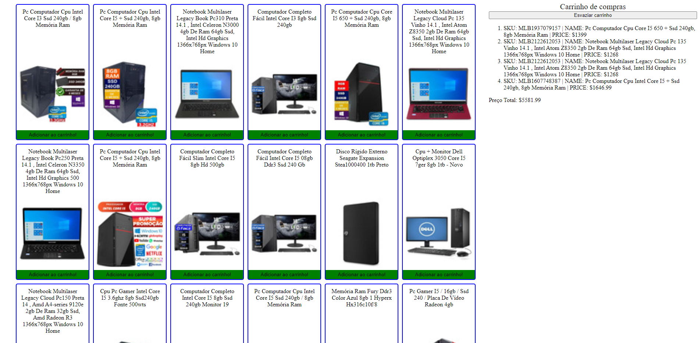

# Shopping Cart

Site utilizando html, css e javascript, com requisição de api com o mercado livre, podendo ver produtos e adicionar ao carrinho.
## Demonstração

## Stack utilizada

**Front-end:** Html, Css, Javascript

## Aprendizados

Aprendi a interagir melhor com o javascript utilizando o DOM, aprendizado de interagir com requisições API, manipulação e ordenação utilizando dados de requisição API.
## Instalação

Coloque a pasta shopping-cart no local desejado.

## Rodando localmente

Para iniciar a aplicação, é preciso abrir o arquivo `index.html` no seu navegador e pronto!

## Autores
### Gabriel

|  |  |  |
| ------|-------|-----|
